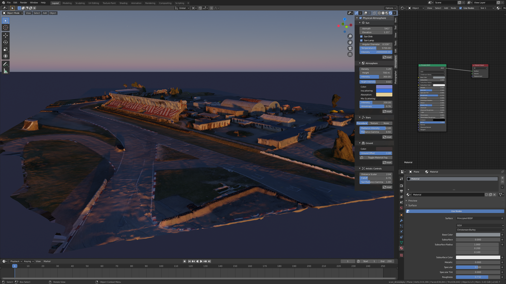
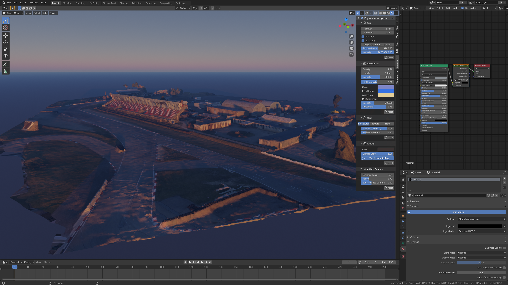

The _Ground_ section offers various controls over the landscape and objects within.

### Ground plane
:octicons-milestone-24: _Default_: `None`

By default, there is no ground plane to color. To add a designated ground plane that you can color switch to _Procedural_
and select ground color.

### Surface offset
:octicons-milestone-24: _Default_: `0` _km_

Surface vertical offset from Blender default origin. Useful for low orbit and aerial shots.

!!! note
    To get correct reflections for high altitude render in _Eevee_ render engine, you need to offset the world. 

### Horizon offset
:octicons-milestone-24: _Default_: `0`

Artistic scalar that moves horizon line up or down.

### Toggle material fog
:octicons-milestone-24: _Default_: `False`

When enabled for every material adds fog that is using the same parameters as the world.

!!! caution
    1. Could reduce overall performance if the scene contains a lot of materials.
    2. Modifies node setup. Read more about it in the "How it works" section :point_down:

??? help "How it works / Troubleshooting"
    1. When enabling, addon looks for every material output node, and before it inserts _StarlghtAtmosphere_ node.
    2. On initialization each material receives custom property `psa_user_modified` with value `0`. This means that this
    material is not modified by the user and the addon can freely modify this material.
    3. Material custom property `psa_user_modified` is set to `1` if the user deletes material or deletes link between
    _StarlightAtmosphere_ and the output node.
    4. If new material is added and _Toggle Material Fog_ is enabled, addon goes through all materials except the ones
    that contain custom property `psa_user_modified` value `1` and adds _StarlightAtmosphere_ node and links it correctly.
    5. When disabling Material Fog, all _StarlghtAtmosphere_ nodes and `psa_user_modified` custom properties are removed.
    
| Before: | After:  |
| -------| -------|
| [{: loading=lazy }](img/fog/FOG_add_fog.PNG)|[{: loading=lazy }](img/fog/FOG_add_fog_3.PNG)| 
    

