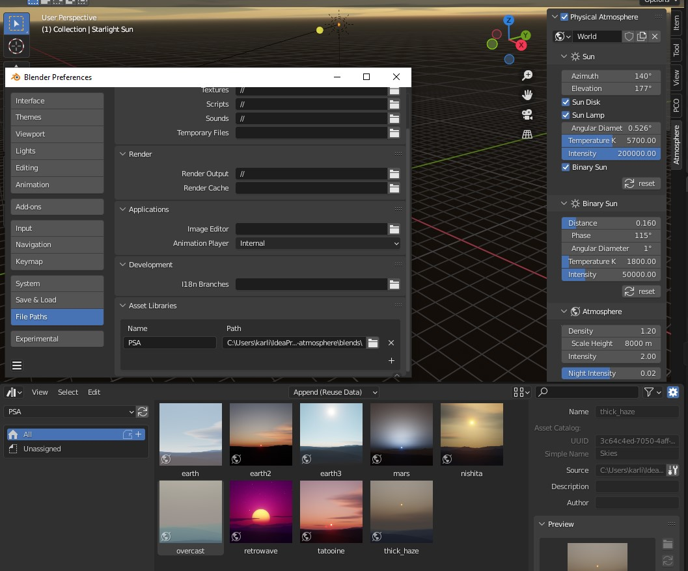

Assets allow to store a snapshot of your customized atmosphere settings and return to it later
or use already predefined presets provided by the addon.

!!! info
     To be able to use PSA predefined assets you have to use Blender version 3.0 and above.

## Importing assets
1. download *assets.blend* file
2. in Blender go to* Edit > Preferences* and open *File Paths* tab
3. Under *Asset Libraries* click + symbol and point to the folder where *assets.blend* file is located.
4. Assign a name to this library

## Using assets
1. In one of the Blender [existing Areas]((https://docs.blender.org/manual/en/3.0/interface/window_system/areas.html#areas))  open *Data > Asset Browser*
2. Under the dropdown select a name you assigned to the library when importing assets.
3. Select an asset and drop it in the view.

