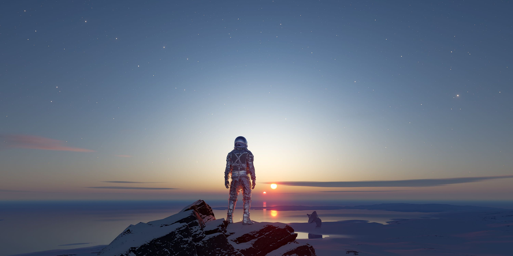
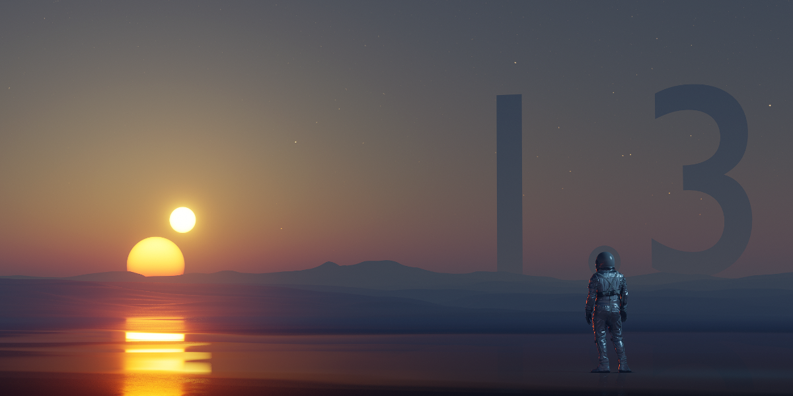

### 1.5.1 <small>- released 17.03.2022</small>

`improvements:`{: .label-improvements }

- Space out shader nodes when the addon is enabled.
- Space out shader nodes for existing 10 atmosphere assets.
- Reduced size of assets file.

`fixed:`{: .label-fixed }

- Apply ACES modifier to applied assets.
- Removed reset buttons as they became obsolete after migrating presets to the asset browser.
- Fixed Nishita preset by removing green hue.
- Fixed fog to include physical value multiplier.
- Fixed `toolbar enabled` setting not functioning properly.

### 1.5.0 <small>- released 03.03.2022</small>

`new:`{: .label-new }

- Now storing information in **world data block** instead of scene.
- Now using built in Blender **Asset Browser** instead of custom preset functionality.
- **5 new presets** (assets) - earth2, earth3, overcast, tatooine, thick haze
- Implemented update script which allows without issues to transfer existing projects with older PSA versions to PSA v1.5.0.  

`improvements:`{: .label-improvements }

- Atmosphere is applied to the existing world, instead of creating a new world with a PSA atmosphere.
- Improved garbage collection for Node Groups.  

`fixed:`{: .label-fixed }

- **Fixed Blender crash** that occured when rendering. {[#43](https://github.com/PhysicalAddons/physical-starlight-and-atmosphere/issues/43)}
- Fixed overexposed Mars preset {[#61](https://github.com/PhysicalAddons/physical-starlight-and-atmosphere/issues/61)}

### 1.4.4-beta <small>- released 14.12.2021</small>

`new:`{: .label-new }

- Added support for ACES color space

`fixed:`{: .label-fixed }

- Fixed issue that after update to v1.4.x gave incorrect values when using 'Use real world physical values' feature
- Fixed issue that gave an TypeError when resetting clouds to defaults using reset button.

`improvements:`{: .label-improvements }

- Binary Sun is now out of the experimental features
- Improved UI for preferences

### 1.4.3-beta <small>- released 07.12.2021</small>

`improvements:`{: .label-improvements }

- Now clouds can be added to the presets.

`fixed:`{: .label-fixed }

- Fixed blender 3.0 compatibility issues.

### 1.3.2 <small>- released 07.12.2021</small>

`fixed:`{: .label-fixed }

- Fixed blender 3.0 compatibility issues.

### 1.4.2-beta <small>- released 26.08.2021</small>

`new:`{: .label-new }

- New UI for Object Fog. Better control over when Object Fog should be applied and when removed. 

`improvements:`{: .label-improvements }

- Improved general addon performance.
- Reduced RAM used by Object Fog.
- Clouds UI moved to the Atmosphere tab.
- Added extra rotation and location parameters for the Clouds.

`fixed:`{: .label-fixed }

- Fixed issue when rendering animation (hitting F12 key) gets a consistent crash. {[#43](https://github.com/PhysicalAddons/physical-starlight-and-atmosphere/issues/43)}
- Fixed issue when using cloud feature were not enabled when using Cycles rendering engine by default. {[#42](https://github.com/PhysicalAddons/physical-starlight-and-atmosphere/issues/42)}
- Fixed issue when animating sun via Sun Position addon resulted in incomplete animation. {[#7](https://github.com/PhysicalAddons/physical-starlight-and-atmosphere/issues/7)}
- Alpha fix. {[#45](https://github.com/PhysicalAddons/physical-starlight-and-atmosphere/issues/45)}

### 1.4.1-beta <small>- released 20.06.2021</small>

`improvements:`{: .label-improvements }

- Increase shadow visibility from 200m to 2km.
- Set Experimental features enabled by default.

### 1.4.0-beta <small>- released 17.06.2021</small>

`new:`{: .label-new }

- Procedural Cloud system.

`improvements:`{: .label-improvements }

- Improve animation performance. Now the atmosphere will be redrawn only if UI parameter has changed.
- Now on `Blender > System > Reload Scripts` all addon scripts are properly reloading.
- Whenever a blendfile is loaded it correctly loads preset defaults it is based on.

`fixed:`{: .label-fixed }

- Fixed issues when installing a new addon version on top of the old one results in console errors. {[#31](https://github.com/PhysicalAddons/physical-starlight-and-atmosphere/issues/31)}
- Fixed issue when addon was not working in multiple scenes. {[#26](https://github.com/PhysicalAddons/physical-starlight-and-atmosphere/issues/26)}
- Fixed issue when _Material Fog_ is active adding a new material caused to lose user made changes in the Shader editor.
  {[#34](https://github.com/PhysicalAddons/physical-starlight-and-atmosphere/issues/34)}

### 1.3.1 <small>- released 16.04.2021</small>

`fixed:`{: .label-fixed }

- Fixed issue that prevents dynamically creating classes in Blender v2.93 and breaks the preset functionality.
  {[#38](https://github.com/PhysicalAddons/physical-starlight-and-atmosphere/issues/38)}

### 1.3.0 <small>- released 13.11.2020</small>

`new:`{: .label-new }   

- Added ability to add or remove Presets (snapshot of your customized atmosphere settings).
- Added 4 presets (_Earth, Mars, Nishita and Retrowave_) that comes default with the addon installation.
- Added `Binary Sun` (secondary sun) that can be rotated around the `Sun`. For more information check section
[Experimental Features](/psa/customization/#experimental-features)

`improvements:`{: .label-improvements }   

- Now `sun intensity` stays consistent even when increasing `sun radius`.
- `azimuth` and `elevation` slider sensitivity increased
- Improve `ground color` accuracy. Now setting it to black will really mean it's black.

`fixed:`{: .label-fixed }

- Fixed an issue when sun was located near horizon the sun color were washed out.  

### 1.2.3 <small>- released 20.08.2020</small>

`fixed:`{: .label-fixed }

- Fixed an issue where `Toggle Meterial Fog` button sometimes appears active when it isn't.
- Fixed an issue where when disabling addon didn't delete all Sun data and left some garbage behind. {[#1](https://github.com/PhysicalAddons/physical-starlight-and-atmosphere/issues/1)}
- Fixed an issue where when rotating sun using gimbal it did a random jump. {[#6](https://github.com/PhysicalAddons/physical-starlight-and-atmosphere/issues/6)}
- Fixed an issue where when animating time using Sun Position addon gave the same frame in output. {[#7](https://github.com/PhysicalAddons/physical-starlight-and-atmosphere/issues/7)}

### 1.2.2 <small>- released 15.07.2020</small>

`new:`{: .label-new }   

- Addon now has preferences to enable or disable real world physical values (by default disabled).

`fixed:`{: .label-fixed }       

- Fixed an issue where disabling addon didn't reset the exposure to defaults {[#8](https://github.com/PhysicalAddons/physical-starlight-and-atmosphere/issues/8)}
- Fixed an issue where when starting the render exposure was being reset {[#11](https://github.com/PhysicalAddons/physical-starlight-and-atmosphere/issues/11)}  

