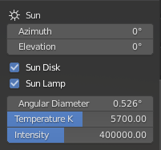
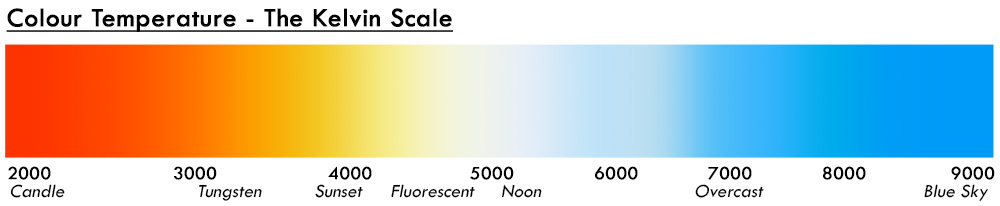

Sun is controlled by these 7 variables:

{: align=right }  

- Sun Azimuth
- Sun Elevation
- Sun Disk checkbox
- Sun Lamp checkbox
- Sun Angular Diameter
- Sun Temperature K
- Sun Radiance Intensity

##Sun Position

Sun position in the sky is controlled by the first two variables - `Azimuth` and `Elevation`. Azimuth moves the Sun
horizontally, elevation - vertically. The values are angle in degrees. This is one of many ways you can control Sun
position. You can move the Sun also by rotating the Sun object itself or use a `Sun Position` addon that comes with
Blender. These two values are added for convenience if your scene is huge and you have lost the Sun object.

##Sun Visibility

Now the next two parameters might seem confusing for some.

- `Sun Disk` checkbox, toggles the visibility of the sun disk in the sky. 
- `Sun Lamp` checkbox, toggles the sun lamp intensity. 

I'll explain why these parameters can be useful. There are few specific cases where you don't want to see the Sun disk
visible in the sky or don't want your scene illuminated by a parametric lamp. For example, if you use Cycles, you can
avoid using a parametric `Sun Lamp` and use the addon as HDRI.

- By _disabling_ both, you get illumination by the sky only. No direct light.
- `Sun disk` _enabled_ and `Sun Lamp` _disabled_, you essentially get a HDRI. Switch to `Cycles` and you will see how
the sun disk is a light source - you get shadows.
- `Sun disk` _disabled_ and `Sun Lamp` _enabled_, you have shadows and direct light, but the sun disk will not be
visible in the sky. (can't think of a useful case for this setting)
- Both _enabled_ - you have both, direct light and sun disk in the sky. 

If you compare `Cycles` renders with `Sun Lamp` enabled and `Sun Lamp` disabled, there might not be a visual difference.
In `Eevee` you will see huge difference in lighting and with no parametric light source there will be no shadows.
This is because `Cycles` will sample every point in the sky as a "light source", and you will see shadows, while `Eevee`
only approximates the lighting and uses the sky as an "irradiance map".

##Sun Disk

- Sun disk size in the sky is controlled by `Angular Diameter` parameter. It also changes the sun lamp Angle value for
soft shadows. Larger the value, bigger the sun disk, brighter it gets. 

!!! Note
    Right now the Sun disk is a 2D circle with parametric apparent diameter, intensity is multiplied with a limb
    darkening factor. In future releases Sun will be calculated differently - as a real 3D sphere with actual physical
    diameter placed reeealy far away, but not at infinity, which will actually allow to travel to the Sun

- `Temperature K` changes the color of the sun disk. Bigger the value, bluer the sun. In theory small stars are hotter,
thus bluer, and big stars colder - redder. I wanted to include the calculation of that, but it would remove artistic
control, so left it as a manual variable.

- `Intensity` changes the sun radiance intensity in Watt·sr/m2.
Default value is 20.0 MegaWatt·sr/m2 (calculated by dividing solar constant with sun disk diameter in steridians)

!!! Info
    In future I might add an option to use Lux values.

## Binary Sun
:octicons-milestone-24: _Default_: `false` · :octicons-beaker-24: Experimental

Add additional sun that rotates around the main sun. 

