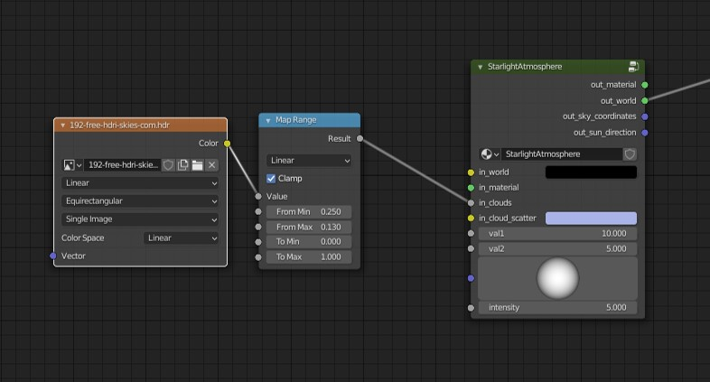

Physical Clouds are based on Blender noise texture and projected on the atmosphere sphere. Sphere height can be modified by `Atmosphere > Scale Height` parameter.

## Parameters

### Scale
Changes scale of the cloud noise texture.

### Thickness
Defines how opaque clouds appear.

### Coverage
Defines cloud coverage minimum and maximum values.

### Lighting Intensity
Defines how much sunlight affects clouds.

### Self Shadowing
Amount of cloud self shadowing.

### Lighting Directional Power
Sun lighting distribution power.

### Inscattering
Cloud in-scattering.

## Other Features

### HDRI clouds

To add HDRI clouds:

1. Open Shader Editor
2. Add environment texture `Add > Texture > Environment Texture`
3. Add mask `Add > Converter > Map Range`
4. Link them as shown in the image below:

### Advanced usage
We encourage advanced Blender users to explore Simple Clouds in Shader Editor.

1. Open Shader Editor
2. Find node `Simple Clouds > FBM`