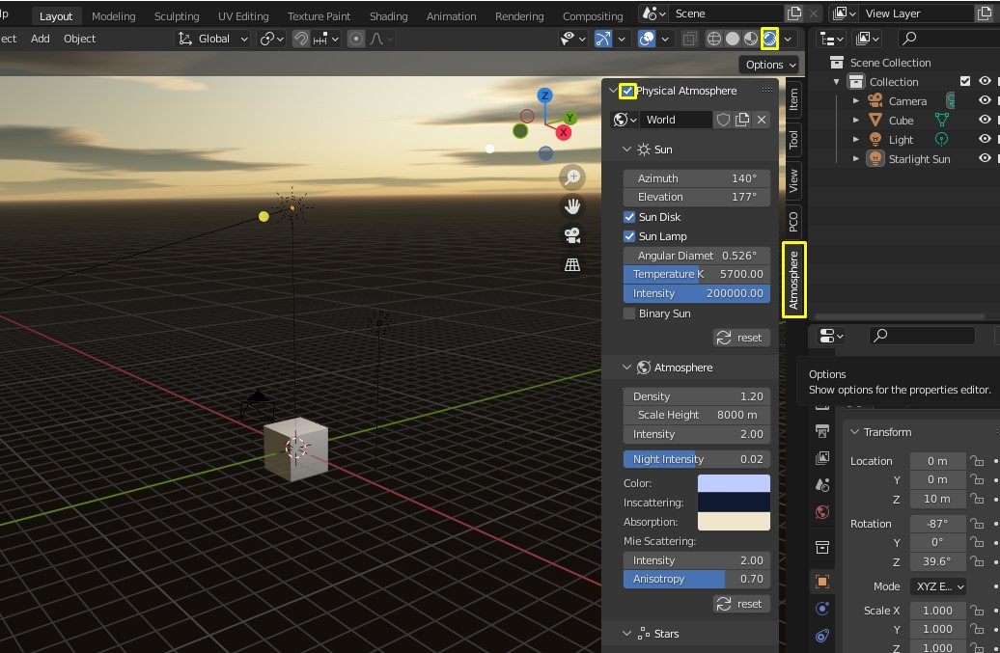

# Getting started

_Physical Starlight and Atmosphere_ (PSA)  is a Blender addon for advanced environmental lighting that provides high quality atmospherics
and lighting, and visual consistency between every object in your scene. It can be installed as any other Blender addon.
## Requirements

Latest _Physical Starlight and Atmosphere_ is supported by [Blender 3.0+](https://www.blender.org/).
Addon versions from v1.2 till v1.4beta works on [Blender 2.81+](https://www.blender.org/).
Older versions of the addon v1.0 and v1.1 work on [Blender 2.80](https://www.blender.org/).

## Installation

!!! info
    "Physical Starlight and Atmopshere" is only available for purchase on
    [Blendermarket](https://blendermarket.com/products/physical-starlight-and-atmosphere) or [Gumroad](https://gumroad.com/l/PSaA).
    Get your latest version there.

- Download the "physical-starlight-atmosphere-[version here].zip" file.
- Open Blender.
- Go to Edit/Preferences. 
- Choose "Add-ons" tab and press "Install..." button. 
- Locate the .zip file and press "Install Add-on".
- You will see the newly installed add-on, enable it by checking the checkbox. 
- Wait till it registers. Voila!

## First Run
- Locate _Physical Starlight and Atmosphere_ panel in [Sidebar](https://docs.blender.org/manual/en/latest/interface/window_system/regions.html#sidebar)
(also called _N Panel_). Click on the tab _Atmosphere_ to reveal it.
- Enable addon by ticking the uppermost checkbox.

 
!!! important
    To see the sky, you have to be in "Rendered" Viewport Shading mode (click on the 4th sphere in the list up in the right corner of 3D viewport)

!!! summary "What happens when addon is being enabled/disabled?"
    - A couple of shader nodes are imported and dynamically added and connected to the currently active world. When you uncheck the _Physical Atmosphere_ checkbox, these nodes will be removed.
    - Sun lamp `Sarlight Sun` is added. The Sun lamp is used as the main light source to cast shadows from the Sun. When you uncheck the _Physical Atmosphere_ checkbox, if no active PSA instances are found in other worlds it will be removed.

## Troubleshooting

Something didn't work as expected? Check out [Frequently Asked Questions](/psa/faq/). 

